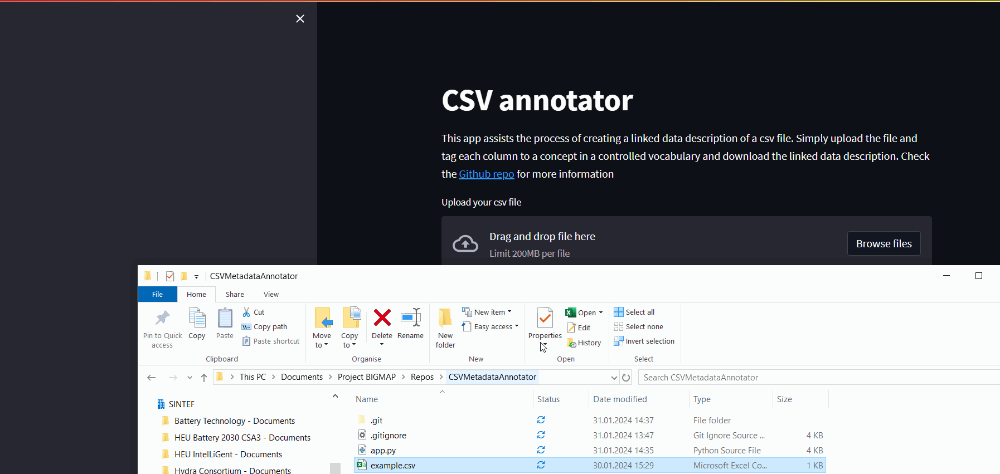

# CSV Metadata Annotator
An app to facilitate the process of creating Linked data descriptions of csv files containing tabular data related to batteries and electrochemistry.

## How to use it

The app can be runned from the streamlit server here:  

> Note: Running this app from the streamlit service means your csv data is uploaded to an **external server.** If you have concerns about **the security of your sensitive data**, then you need to carry out the local installation to run the app in your PC.

## Local installation

Clone this repository:  
 `git clone https://github.com/BIG-MAP/CSVMetadataAnnotator.git`  

Install the necessary packages in your Python environment:  
`pip install -r requirements. txt`  

Run the app from the root directory:  
`streamlit run app.py`

## How it works
The app loads your csv file and reads the column names from the first row, and additional attributes of the files. Then it displays input boxes, to match each column to a quantity, optional metric prefix and unit entities, as described in the BattINFO ontology.  
 

The columns have been annotated, the left-sidebar displays the current JSON-LD description. Once the column have been annotated, you can donwload the JSON-LD file. This file will make Semantic Systems aware of the meaning and contents within your electrochemical data.

## Troubleshooting
If you csv file cannot be read, it can be because:
* The file is corrupted or not a valid csv
* The column names are absent
* The column names are not in the first row
In these cases is recommended to load the file with a spreadsheet program (e.g. MS Excel), correct the issues and export as a valid csv.
